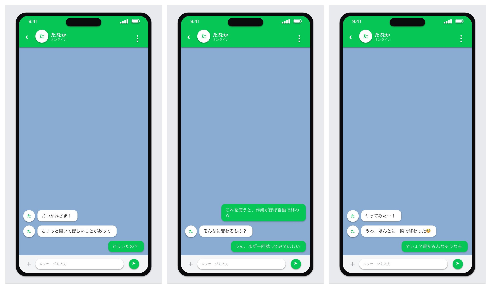

# LINE風チャット スライド ジェネレーター

会話を入力するだけで、iPhone画面風・LINE風グリーンの縦型（9:16）スライドを生成するWebアプリです。吹き出しが1つずつアニメーションで表示される、登壇・プレゼン向けの `.pptx` を作れます。

**デモ: https://line-chat-app-nine.vercel.app**


## 特徴

- iPhone風UI（Dynamic Island・ステータスバー・端末フレーム）
- LINE風グリーンのチャット（自分 = 緑・右、相手 = 白・左＋アバター）
- 吹き出しが順番にフェードイン（PowerPointのアニメーションとして出力）
- 自然言語で入力（`L:` 相手 / `R:` 自分、空行で次のスライド）
- 縦型 9:16、配置は下詰め / 上詰め / 中央を切替可能
- ブラウザでライブプレビュー＆アニメ再生

## 生成されるスライド例



## 使い方

1. デモURL（または自分のデプロイ先）を開く
2. 相手の名前・配置・出る間隔を設定する
3. 会話を入力する
4. 「プレビュー再生」で動きを確認する
5. 「PPTXをダウンロード」→ PowerPoint / Keynote で開く（スライドショーでアニメ再生）

### 会話の書き方

```
L: おつかれさま！
L: ちょっと聞いてほしいことがあって
R: どうしたの？

L: 最近これに時間取られててさ
R: あー、わかる
```

- `L:` = 相手（白・左）、`R:` = 自分（緑・右）
- 空行で次のスライドに区切られます
- 複数行の吹き出しは、次の行に `L:` / `R:` を付けずに続けて書きます

## 技術構成

- フロント: 静的 HTML / CSS / JS（フレームワーク無し）
- 生成: Vercel Python サーバーレス関数（`api/generate.py`）+ [python-pptx](https://python-pptx.readthedocs.io/)
- アニメーション: スライドXMLに Float In（フェード＋浮き上がり）の timing を直接注入
- ホスティング: Vercel

```
.
├─ index.html        フロント（入力フォーム＋ライブプレビュー）
├─ api/generate.py   会話JSON → pptx 生成（build_pptx）+ ハンドラ
├─ requirements.txt  python-pptx
├─ vercel.json       builds（静的 + @vercel/python）
├─ dev_server.py     ローカル確認用
└─ assets/           README用プレビュー画像
```

## ローカル開発

```bash
pip3 install -r requirements.txt
python3 dev_server.py   # http://localhost:8000
```

## デプロイ（Vercel）

```bash
vercel --prod
```

`requirements.txt` から python-pptx が自動インストールされ、`api/generate.py` が Python 関数として動作します。
